# Lambda Functions URLとRDS連携
Lambda Functions URLを使用して、RDS PRoxy経由でRDSとの連携を行う。

## アーキテクチャ

* Lambdaはプライベートサブネットに配置
  * パブリックサブネットに置いても、パブリックIPが付与されないのでそのままではインターネットアクセスができない。VPC外にも接続できない。そのためプライベートサブネットに配置
* NAT Gateway等は無いが、Functions URLを使用してリプライも返ってくる
  * パブリックに公開しているから
* DBの接続情報はSecrets Managerから取得
  * RDS Proxyの認証のため。